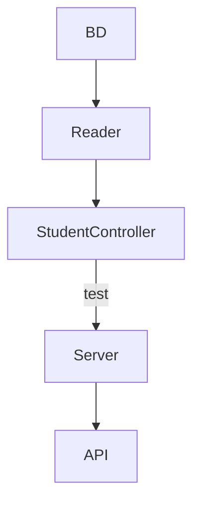

# Code-Challenge
Practica 5 de la semana 4 requerimientos:

1. Habilitar un endpoint para consultar todos los estudiantes con todos sus campos.
2. Habilitar un endpoint para consultar los emails de todos los estudiantes que tengan certificación `haveCertification`.
3. Habilitar un endpoint para consultar todos los estudiantes que tengan `credits` mayor a 500.

### Dependencias Utilizadas

1. Utilización de `JTEST` para emplear los test.
2. Utilización de `express` para automatizar servidores.
3. Utilización de `linter` para correción de codigo.

### Diseño de componentes

### Explicación de la API
